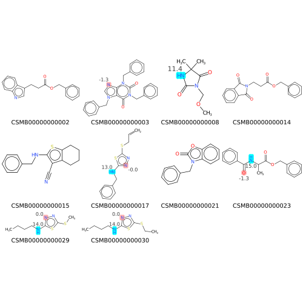

# Job: cdk-depict-mols

This describes how to run the `cdk-depict-mols` job from the `miscellaneous` category in the `cdk-depict` collection.

## What the job does

This job generates 2D molecule depictions using the CDK toolkit.
Various output formats are supported, including SVG, PNG, JPG and PDF.

Supported rendering features include:
- multiple molecules as a grid
- different atom coloring schemes
- display a title for each molecule
- display atom labels, read from SD-file fields
- alignment to, and coloring of MCS substructure

## Implementation details

* Job implementation: [Mol2Image.java](/cdk-depict/src/mail/java/org/squonk/cdk/depict/Mol2Image.java)
* Job definition: `jobs.cdk-depict-mols` in [cdk-depict.yaml](/data-manager/cdk-depict.yaml)
* CDK depicter class: [DepictionGenerator](http://cdk.github.io/cdk/latest/docs/api/org/openscience/cdk/depict/DepictionGenerator.html)

## How to run the job

### Inputs

* **Input molecules**: The molecules to depict, in SD-file format. Note: we hope to support additional formats in future.

### Options

This job has a large number of options to provide a wide range of flexibility, but typically you only need to specify a
few of them. Most have sensible defaults.

* **Output file**: The name of the output file. The format to output is determined using the file extension: .svg, .png etc.
* **Image width**: The width of the generated image (in pixels).
* **Image height**: The height of the generated image (in pixels).
* **Image padding**: The padding around each molecule (in pixels).
* **Background color**: The background color (1). If not specified transparent background is used.
* **Title field**: The field name used for the title. For the title line (first line) use cdk:Title.
  If not defined then no title is displayed.
* **Title scale**: The scale factor (relative to the atom font) used for the title. Default 1.
* **Title color**: The color for the title (1, 2).
* **MCS to highlight/align**: A SMILES string containing the substructure for determining the Maximum Common Substructure (MCS).
    Structures are aligned to the atoms comprising the MCS.
* **MCS color**: The color for the highlighting the MCS (1). If not specified then the molecules are aligned but nor highlighted.
* **Field names with highlight data**: Names of fields in the SD-file containing atom information to displayed as atom labels (3).
* **Colors for field highlighting**: Colors for highlighting the atoms that are labeled (1, 4)
* **Label color**: The color for the atom labels (1).
* **Label scale**: The scale for the atom label text (relative to the font used to display the atoms). Default 1.
* **Label distance from atom**: The distance from the atom that the labels are displayed (relative to the bond length). Default 0.25.
* **Highlight atoms using outer glow**: Use "outer glow" to highlight the atoms rather that coloring the atom symbols.
  This is particularly useful when displaying atom labels (see example below).

Notes:

1. Color is specified as one of the String values of the color constants in
   the java.awt.Color class. (see https://docs.oracle.com/javase/8/docs/api/java/awt/Color.html).
   For reference the valid color values are: black, blue, cyan, darkGray (DARK_GRAY), gray, green, lightGray (LIGHT_GRAY),
   magenta, orange, pink, red, white, yellow (the upper case equivalents are the same unless shown in brackets).
2. The title is read from the SD-file title line (e.g. the first line of the record)
3. Multiple fields can be specified. See below about the format of these fields.
4. Multiple colors can be specified, and they correspond to the field names specified in the *Field names with highlight data*
   (hence the number of values must be the same). See example below.

## Outputs

The file specified by the *Output file* option is created using the file format implied by the file extension.
e.g. to generate a SVG file specify a file name like `molecules.svg`
e.g. to generate a PNG file specify a file name like `molecules.png`

## Examples

### Atom labels

Atom properties can be added to the depictions as atom labels. These properties are read from SD-file fields. As an example
we will show how predicted pKa values can be shown. Let's assume that you have generated a SD-file with basic and acidic 
pKa values encoded in the SD-file like this:

```
>  <APKA>
2 15.0

>  <BPKA>
4 -1.3
7 2.3
```

*Note that the `chemaxon-molecular-props-pka` job in the `chemaxon` collection can generate this data, though this
requires a ChemAxon protonation license.*

The format of this data is as follows:
1. each atom to be labeled is a separate line (e.g. the field's text can have multiple lines).
2. each line is formatted as `atom_number value` e.g. `2 15.0` which means the value to display for atom 2 is 15.0. These
   are separated with a space character.
3. atom indexes start at 0, not 1.

The to depict these labels use the following options:
* **Field names with highlight data**: BPKA, APKA (this means specify 2 values, the first being BPKA, the second APKA)
* **Colors for field highlighting**: PINK, CYAN (this means specify 2 values, the first being PINK, the second CYAN).
    See notes 1 and 2 above.
* **Highlight atoms using outer glow**: true (check the checkbox).

This would allow you to generate a depiction like this where the pKa values are displayed alongside the atom and the 
pink and cyan "outer glow" highlighting indicates whether the value is an acidic or basic pKa:


